# 04 — Database Architecture & ER Diagram (Phase 5)

MySQL 8 / InnoDB, `utf8mb4`. Conventions applied to **every** table unless noted:

- `id` BIGINT UNSIGNED PK (auto-increment).
- **`branch_id`** FK on all tenant-owned tables (isolation backbone — doc 05).
- `created_by`, `updated_by` (user FK, nullable), `created_at`, `updated_at`.
- **Soft deletes** (`deleted_at`) on all masters and financial/academic records (brief R11).
- Reference tables carry `name`, `name_bn` (bilingual), `serial` (INT, sort), `status`
  (TINYINT/enum active-inactive) — mirrors the confirmed setup pattern.
- Money = `DECIMAL(12,2)`; marks = `DECIMAL(6,2)`.
- FKs `RESTRICT` on delete by default (soft-delete instead); pivots `CASCADE`.

## 1. Table groups (complete list)

**Identity & tenancy:** `organizations`, `branches`, `users`, `branch_user` (pivot, per-branch role),
`roles`, `permissions`, `role_has_permissions`, `model_has_roles`, `model_has_permissions`,
`personal_access_tokens`, `settings`, `audit_logs`.

**Academic:** `academic_years`, `classes`, `shifts`, `sections`, `groups`, `categories`,
`class_configs` (class×shift×section), `group_configs` (class×group), `subjects`.

**Admissions:** `admission_years`, `admission_classes`, `quotas`, `quota_configs`,
`admission_applications`.

**Students:** `students`, `student_enrollments` (per-session class/section/roll — history),
`guardians` (or embedded), `student_documents`, `transfer_certificates`, `testimonials`, `certificates`.

**HR:** `designations`, `hr_sections` (departments), `employees`, `subject_teacher` (teacher↔subject↔class_config).

**Attendance:** `attendance_devices`, `attendance_device_maps` (device_uid→employee/student),
`attendance_time_configs`, `attendance_periods`, `student_attendances`, `employee_attendances`,
`attendance_punches` (raw), holidays.

**Routines:** `class_routines` (class_config×day×period×subject×teacher×room), `exam_routines`
(exam×subject_config×date/time/room).

**Examinations & Results:** `exam_types` (confirmed values: Weekly, Monthly, Final, Grand Final),
`exams` (with `merit_process_type` ∈ Total-Mark/Grade-Point × Sequential/Non-Sequential),
`exam_short_codes`, `grades` (per class),
`exam_configs`, `exam_subject_configs`, `mark_configs` (per subject×short_code), `final_mark_configs`,
`fourth_subject_configs`, `class_teacher_configs`, `signature_configs`, `admit_instructions`,
`marks` (student×mark_config), `results` (student×exam aggregate), `result_positions` (merit).

**Fees:** `fee_heads`, `fee_sub_heads`, `fee_sub_head_configs`, `fee_configs`, `fee_waivers`,
`fee_waiver_configs`, `fee_time_configs`, `student_fees` (assessed payable), `fee_collections`
(receipts), `fee_collection_items`.

**Accounting:** `ledger_accounts` (chart of accounts), `vouchers` (receive/payment/contra/journal),
`voucher_entries` (double-entry debit/credit lines).

**Messaging:** `sms_templates`, `contacts` (phone book), `sms_batches`, `sms_messages` (delivery log),
`sms_balances`.

**CMS:** `posts` (polymorphic by `type`), `menus`, `menu_items`, `website_settings`.

**Shared:** `media`/`attachments` (polymorphic), `id_card_templates`, `jobs`, `failed_jobs`,
`notifications`.

## 2. The join backbone (most important design point)

The confirmed pivots `class_config` and `group_config` are the spine:

- **`class_configs`** = a concrete teaching unit `(branch, class, shift, section)`. Students enrol into
  a class_config **per academic year**. Attendance, class routine, exam mark scope, and fee config all
  reference `class_config_id` (directly or via the enrollment).
- **`student_enrollments`** is introduced (not a single flat `students.class_id`) so a student's
  class/section/roll is **historical per session** — this is what makes Migration (promote/push-back)
  and multi-year reporting correct. `students` holds identity; `student_enrollments` holds the
  session-specific placement + `roll`.

```
students (identity) 1───∞ student_enrollments ∞───1 class_configs ∞───1 academic_years
                                     │                     ├──1 classes
                                     └─ roll, group_id     ├──1 shifts
                                        category_id        └──1 sections
```

## 3. ER diagram (core — Mermaid)

```mermaid
erDiagram
    ORGANIZATIONS ||--o{ BRANCHES : has
    BRANCHES ||--o{ BRANCH_USER : grants
    USERS ||--o{ BRANCH_USER : "member of"
    BRANCHES ||--o{ ACADEMIC_YEARS : owns
    BRANCHES ||--o{ CLASSES : owns
    BRANCHES ||--o{ SHIFTS : owns
    BRANCHES ||--o{ SECTIONS : owns
    BRANCHES ||--o{ GROUPS : owns
    BRANCHES ||--o{ CATEGORIES : owns

    CLASSES ||--o{ CLASS_CONFIGS : "in"
    SHIFTS ||--o{ CLASS_CONFIGS : "in"
    SECTIONS ||--o{ CLASS_CONFIGS : "in"
    CLASSES ||--o{ GROUP_CONFIGS : "in"
    GROUPS ||--o{ GROUP_CONFIGS : "in"

    STUDENTS ||--o{ STUDENT_ENROLLMENTS : has
    ACADEMIC_YEARS ||--o{ STUDENT_ENROLLMENTS : scopes
    CLASS_CONFIGS ||--o{ STUDENT_ENROLLMENTS : places
    GROUPS ||--o{ STUDENT_ENROLLMENTS : optional
    CATEGORIES ||--o{ STUDENT_ENROLLMENTS : optional

    STUDENTS ||--o{ TRANSFER_CERTIFICATES : issued
    STUDENTS ||--o{ STUDENT_FEES : assessed
    STUDENTS ||--o{ STUDENT_ATTENDANCES : marked

    DESIGNATIONS ||--o{ EMPLOYEES : holds
    HR_SECTIONS ||--o{ EMPLOYEES : "in dept"
    EMPLOYEES ||--o{ SUBJECT_TEACHER : teaches
    SUBJECTS ||--o{ SUBJECT_TEACHER : taught
    CLASS_CONFIGS ||--o{ SUBJECT_TEACHER : "for"

    EXAM_TYPES ||--o{ EXAMS : categorizes
    EXAMS ||--o{ EXAM_CONFIGS : configured
    CLASS_CONFIGS ||--o{ EXAM_CONFIGS : "for"
    EXAM_CONFIGS ||--o{ MARK_CONFIGS : defines
    SUBJECTS ||--o{ MARK_CONFIGS : "of"
    EXAM_SHORT_CODES ||--o{ MARK_CONFIGS : component
    MARK_CONFIGS ||--o{ MARKS : records
    STUDENTS ||--o{ MARKS : earns
    EXAMS ||--o{ RESULTS : produces
    STUDENTS ||--o{ RESULTS : "for"
    CLASSES ||--o{ GRADES : "grade scale"

    EXAMS ||--o{ EXAM_ROUTINES : schedules
    CLASS_CONFIGS ||--o{ CLASS_ROUTINES : "timetabled"
    SUBJECTS ||--o{ CLASS_ROUTINES : slots
    EMPLOYEES ||--o{ CLASS_ROUTINES : assigned

    FEE_HEADS ||--o{ FEE_SUB_HEADS : groups
    FEE_SUB_HEADS ||--o{ FEE_CONFIGS : priced
    CLASS_CONFIGS ||--o{ FEE_CONFIGS : "per class"
    STUDENTS ||--o{ FEE_COLLECTIONS : pays
    FEE_COLLECTIONS ||--o{ FEE_COLLECTION_ITEMS : contains
    FEE_COLLECTIONS ||--o{ VOUCHERS : posts
    LEDGER_ACCOUNTS ||--o{ VOUCHER_ENTRIES : "debit/credit"
    VOUCHERS ||--o{ VOUCHER_ENTRIES : lines

    STUDENTS ||--o{ CONTACTS : "phone book"
    SMS_TEMPLATES ||--o{ SMS_BATCHES : uses
    SMS_BATCHES ||--o{ SMS_MESSAGES : sends
```



## 4. Selected table definitions (representative)

### branches
| col | type | notes |
|---|---|---|
| id | bigint PK | |
| organization_id | bigint FK | tenant parent |
| name / name_bn | varchar | |
| code | varchar unique(org) | short code |
| address, phone, email, logo_path | | branch identity |
| current_academic_year_id | bigint FK null | active session default |
| settings | json | per-branch config (SMS sender id, grade rules toggles) |
| status | tinyint | |
| soft/timestamps | | |
Indexes: `(organization_id)`, unique `(organization_id, code)`.

### students
| col | type | notes |
|---|---|---|
| id | bigint PK | |
| branch_id | bigint FK | isolation |
| student_uid | varchar | branch-unique human id / admission no |
| name, name_bn | varchar | |
| sex, religion, blood_group | enum/varchar | |
| dob | date null | |
| fathers_name, mothers_name | varchar | |
| mobile, father_mobile, mother_mobile | varchar | |
| photo_path | varchar null | |
| present_address, permanent_address | text null | |
| status | enum(active,transferred,left,passed_out) | status machine |
| soft/timestamps/by | | |
Indexes: `(branch_id, status)`, unique `(branch_id, student_uid)`, `(branch_id, mobile)`.

### student_enrollments  (history — the crux)
| col | type | notes |
|---|---|---|
| id | bigint PK | |
| branch_id | bigint FK | |
| student_id | bigint FK | |
| academic_year_id | bigint FK | session |
| class_config_id | bigint FK | class×shift×section |
| group_id | bigint FK null | |
| category_id | bigint FK null | |
| roll | varchar | class-roll |
| is_current | boolean | fast "this session" filter |
| enrolled_at, left_at | date | |
Unique: `(class_config_id, academic_year_id, roll)` — **roll uniqueness rule**.
Unique: `(student_id, academic_year_id)` — one placement per session.
Index: `(branch_id, academic_year_id, class_config_id)`.

### marks
| col | type | notes |
|---|---|---|
| id | bigint PK | |
| branch_id | bigint FK | |
| student_id | bigint FK | |
| mark_config_id | bigint FK | subject×short_code component |
| exam_id | bigint FK | denormalised for query speed |
| obtained | decimal(6,2) null | |
| is_absent | boolean | xor with obtained |
Unique: `(student_id, mark_config_id)`. Index: `(branch_id, exam_id, student_id)`.

### vouchers / voucher_entries (double-entry)
`vouchers(id, branch_id, type[receive|payment|contra|journal], voucher_no, date, note, total, created_by)`;
`voucher_entries(id, voucher_id, ledger_account_id, debit decimal(12,2), credit decimal(12,2))`.
**Integrity rule:** `SUM(debit) = SUM(credit)` per voucher (enforced in Action + verified in tests).

### posts (CMS polymorphic)
`posts(id, branch_id, type[page|news|notice|slider|teacher|staff|committee|gallery|result|homepage_person|instruction], title, slug, body, description, keywords, image_path, meta json, status, published_at)`.
Index `(branch_id, type, status)`, unique `(branch_id, type, slug)`.

## 5. Relationship explanation (key ones)

- **Org → Branch → everything:** two-level tenancy; all business tables carry `branch_id` (doc 05).
- **Student vs Enrollment:** identity is permanent; placement is per session → clean promotion history,
  correct historical results/fees, no destructive class changes.
- **class_config as hub:** attendance, routine, exam config, fee config, subject-teacher all point here,
  so a "section" is one row everyone shares.
- **Fees → Accounting:** `fee_collections` raise a `voucher` (event-driven) so the GL stays the single
  source of financial truth.
- **Exam chain:** `exam_config → mark_config → marks → results → positions`, with `grades` (per class)
  and `fourth_subject_configs` feeding GPA.

## 6. Constraints, indexing & integrity

**Indexing strategy**
- Every `branch_id` leads a composite index matching the module's dominant filter
  (`(branch_id, academic_year_id, class_config_id)` for enrolment/marks/fees list screens).
- Unique business keys: roll-per-section-session, student_uid-per-branch, voucher_no-per-branch,
  post slug-per-type-per-branch, reference `name`-per-branch.
- Covering indexes for the heavy report queries (student lists, tabulation).
- Full-text index on `students(name, fathers_name, mobile)` for search (or a `search` generated column).

**Data-integrity rules**
- FK constraints everywhere (no orphan marks/fees).
- Application-level invariants in Actions **and** DB constraints as backstop (defence in depth):
  voucher balance, mark ≤ total_marks, absent xor mark, one current enrollment per session.
- Soft deletes + `restore`; hard delete only via admin tooling.
- All multi-row writes (bulk registration, mark input, result process) in a single transaction.
- **No duplicated data** beyond deliberate, documented denormalisation (`marks.exam_id`,
  `student_enrollments.is_current`) for query performance — each noted at its column.

## 7. Migrations & seeding strategy (design only — not written yet)

- Migrations live per-module (`Modules/*/Database/Migrations`), ordered by dependency
  (organizations → branches → academic → …).
- Seeders: permission catalog, default roles (Super Admin/Admin/…), a demo branch, reference data,
  grade scales — reproducing the demo so parity can be verified against the old app.
